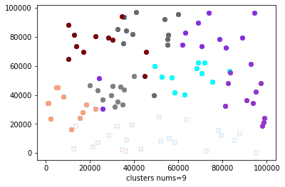

# WRSN_project
这是WRSN课题组的项目。主要研究多智能体充电的问题：简单而言，研究的是在一个无线传感器网络中，有两类节点：传感器节点sensor(静止的），移动充电器（MC). 大概目的是传感器节点消耗能量，MC需要给它们充电，维持传感器的工作。MC会从基站或仓库（depot)出发，以一定规划好的路径给传感器进行充电。我们的目标就是研究出一种充电策略，尽可能少的MC, 尽可能地使节点在消耗完能量前进行充电，尽可能最大化充电效率。

我们目前的想法是：设置多个MC, 并设置多个depot，每个depot负责一定的区域内的传感器节点，并尽可能派出少的MC去完成任务。
我们现在采用的几个算法：

### Ⅰ. 极小化MC的算法：

详见`data\`目录下的算法描述，与此相关的`.py`文件为：`depots_deployment.py`, 实际运行该算法时，运行`main.py`文件。

- 区域划分算法
- 最小生成树算法确定每个区域内MC的数量

### Ⅱ. 路径规划测试上述I的算法

与此相关的文件为：`first_test_performance.py`。

基本思路是，利用**算法Ⅰ**生成的结果：depot的部署位置，每个depot负责的传感器的节点，每个区域MC的数量。对于每一个区域，使用以下的两种路径规划算法，即MC按照什么路径去给传感器节点进行充电：

- 距离优先

  对于需要充电的传感器节点，先把它们放入一个优先队列，优先级按照它们离当前MC的距离越小越优先进行选择充电。一些约束条件如下：

  - MC能够返回充电桩（MC路途要消耗能量）
  - MC可以给节点充电充满
  - MC要在节点消耗完电量之前到达进行充电

- 剩余电量优先（未实现）

  和上面距离优先相比，只是把优先级变为了节点的剩余电量或存活时间，具体得讨论。

根据上述两种调度算法，得到MC的充电效率以及节点的存活率来衡量**算法I**的效果。

**每次记得维护此READMED.md文件，建议在写之前加上时间**

代码文件说明：`first_test_performance.py`
>- `__init__.py`: 不用管
>- `myUtil.py`: 封装一些配置函数和一些配置变量，比如debug函数
>- `main.py`: 测试函数，我们先让我们的算法跑起来，写的一个测试函数, 即我们**只需要运行该文件来跑我们的算法！**
>- `depots_deployment.py`: 算法的主要代码：包括 shuitang 和 baiyun 写的算法部分的代码
>- `my_depots_deployment.py`: baiyun 那部分的代码，先已经把该部分代码全部加入到 `depots_deployment.py`
>- `参数笔记.txt`: 白云的参数
>- `first_test_performance.py`: 根据之前算法得到的depot和区域，使用距离优先和时间优先来规划充电路径，得到存活率和充电效率

## 2020-4-14

现在正在测试，我重写了`WRSNEnv`部分代码，在`depots_deployment.py`已写注释(搜索 By shuitang)。具体而言：重写了 `__init__`部分，只初始化了部分目前用得上的变量。

### 算法I中区域划分的实验结果

目前的结果如下：

## 算法性能评估指标
1. predicted survival rate of sensor nodes (mininum charging duration: charging time of MC + maintainance; if a sensor owns enough energy till the end of mininum charging duration, we say it survives.)
2. predicted charging utility of MCs (charged_energy / (moving_energy + charged_energy)

## 2020-4-20 新一轮测试

新添加了`first_test_performance.py`

## 新的工作2020-04-25

- 关于初始化节点的配置和充电周期的开启问题。
  - 随机分布50%-100%，之后
- 周期性收集请求。emmmmm??
- live_rate => successful_charging_rate
- 多记录一个充电周期里面，有多少个节点能进行充电。（>=30/per circle是一个正常的范围）
todo:
- 输出一些结果的平均值
- 存活率，成功充电率，被充电结果的个数（35~55内），确保确认准确无误前提
- 把两个贪心实现
- 输出充电桩的部署配置，挑几个充电次数比较多的

### 4.30讨论
首先，对于我们的网络而言，传感器发送充电请求，但还是有几天时间存活；
然后，MC在为自己负责的部分传感器充电后，如果MC本身的电量还有剩的话，就在没有充电请求的节点中挑选一个出来；

第一部分：更新算法1，在depot增加时，至少要减少3个MC

第二部分：实现剩余时间优先的贪心算法，并引入周期性模拟;把之前的充电效率和成功充电率的分子和分母输出。

第三部分：首先进行周期性的模拟，每个循环是60秒。优化：MC给自己负责的充电请求节点充完电后，再建立伪。充电请求队列，然后将未发送充电请求的传感器以剩余电量和距离以一定的权重和来放入队列，选择队列，如果队列遍历都找不到传感器，那就算了，直接返回（因为要判断MC是否可以前往，充满电，再返回depot）
